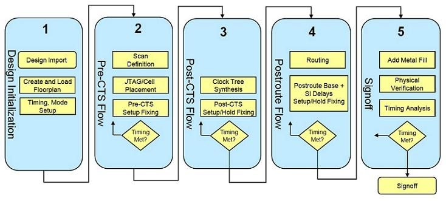

^-^
# Standard Digital Design Flow
This is a complete tutorial for you to get familiar with the standard digital design flow.
It contains a complete skeleton (the `SKELETON` directory, using umc065 process as an example) for
you to do your own digital design, from RTL HDL design all the way to physical layout for tape-out.

## Disclaimer
This so-called *"standard digital design flow"* is not for fully-digital design like CPU or others.
Instead this digital design flow works for mixed-signal design where the digital part finally has
to be integrated with the analog part. So the ultimate production of this flow would be a compact
digital layout with specified ports to be integrated with other analog layout.

## Standard Digital Design Flow
A standard digital design flow consists of
1. RTL HDL Design
2. Behavior Simulation (platform: Synopsys&reg; VCS)
3. Logic Synthesis (platform: Synopsys&reg; Design Compiler)
4. Post-synthesis Simulation (platform: Synopsys&reg; VCS)
5. Place & Route (platform: Cadence&reg; Encounter Digital Implementation)
6. Post-layout Simulation (platform: Synopsys&reg; VCS)
7. Integration with Analog Part (platform: Cadence&reg;)

Note that the above steps are iterative. For example, after logic synthesis, it is possible
that the design no longer meets the design specification, thus you need to fall back to
step 3 or even step 2 and 1 to find the reason and fix the problem.

## The SKELETON Working Directory
The provided directory named `SKELETON` is a sample working directory for your digital design
flow. Within this directory all the steps mentioned in previous section will be performed, 6
directories are set for 6 steps respectively. The structure of `SKELETON` working directory is
shown below.


Now we can establish the relationships of each directory to each step (from step 1 to step 6) in
the flow above.
- RTL HDL design &mdash; `SKELETON/verilog`
- Behavior simulation &mdash; `SKELETON/pre_sim`
- Logic synthesis &mdash; `SKELETON/syn`
- Post-synthesis simulation &mdash; `SKELETON/syn_sim`
- Place & route &mdash; `SKELETON/soc`
- Post-layout simulation &mdash; `SKELETON/post_sim`
- Integration with analog part &mdash; Inside Cadence

Whereas `SKELETON/Makefile` is used for easier operation of each step. There are other resources
used during each process but not included here. They will be declared at prerequisite section
for each step if necessary.

It is strongly recommended that you keep everything the same way. You can change the names and
paths according to your flavor but you must modify `SKELETON/Makefile` appropriately. To start,
change the current working directory to the same directory as `Makefile`. Type `make init` in
terminal to check the environment configurations.
```console
[SKELETON]$ make init
```

## Prerequisite
In order to ensure that this tutorial works the best for you, a few prerequisites must be met.
If you are not [IPEL](http://www.ece.ust.hk/~ipel) members or are not using the same process
as in this tutorial, it should still be adequate enough for you to establish everything
accordingly.

### Linux Command Line Environment
First of all, it is very important for users to get used to the Linux development
environment, especially the Linux command line. A lot of the operations in the design flow
are done with Linux command line and sometimes only possible to be done with command line.
Thus, you must get familiar with the command line working environment.

Another prerequisite would be that you have all your tool chains properly set up and necessary
resources regarding digital design provided by the foundry. For example, this tutorial is for
[IPEL](http://www.ece.ust.hk/~ipel) members, and the tool chains are specified according to
IPEL Linux servers. Furthermore, umc065 process is used as example, so if you are using
other process, you are on your own to find out all the corresponding resources vital for
digital design flow.

### Tool Chain Setup
As mentioned above, we have to use different sets of tool chains to complete each step. For
[IPEL](http://www.ece.ust.hk/~ipel) members, all the required tools are available on the Linux
server.
- Synopsys&reg; VCS
- Synopsys&reg; Design Compiler
- Cadence&reg; Encounter Digital Implementation

To setup the tools properly, you should put the following lines to your `~/.cshrc_user` so that
they could be loaded by default each time you start a terminal.
```sh
source /usr/eelocal/synopsys/vcs_mx-vi2014.03-2/.cshrc  # Synopsys VCS
source /usr/eelocal/synopsys/syn-vi2013.12-sp5-5/.cshrc # Synopsys Design Compiler
source /usr/eelocal/cadence/edi142/.cshrc               # Cadence  EDI
```

Currently (May 2018) all these tools are up-to-date. Update the tools if newer versions are
available.

### Digital Standard Cell Library
The digital standard cell library should be prepared in advance. A Cadence library containing all
the standard digital cells (like AND, XOR, DFF, etc.) is a must, in which abstract view, layout
view, symbol view and schematic view are ready for later usage (some special cells may have some
views missing). Necessary resources are provided by the foundry to be imported into Cadence to
make such a library. For umc065 process, the deliverable content would be

| Directory name/path | Description                                                                  |
| ------------------- | ---------------------------------------------------------------------------- |
| doc                 | A directory containing the files of databook.pdf, cell list, etc.            |
| cir                 | A directory containing the netlist file after RC extraction                  |
| lvs\_netlist        | A directory containing the netlist file for LVS                              |
| gds                 | A directory containing the GDSII file                                        |
| synopsys            | A directory containing the files of Synopsys NLDM liberty models             |
| synopsys/ccs        | A directory containing the files of Synopsys CCS Timing/Noise liberty models |
| symbol              | A directory containing the Cadence composer symbol and EDIF symbol           |
| verilog             | A directory containing verilog model                                         |
| fastscan            | A directory containing ATPG model                                            |
| vital               | A directory containing vital model                                           |
| lef                 | A directory containing lef macro files and technology files                  |
| milkyway            | A directory containing ICC technology files and database                     |

## Step 1: RTL HDL Design
The very first step of the digital design flow is to prepare your verilog HDL design based on
the desired functional specification. A skeleton verilog file `SKELETON.v` is already provided
under `SKELETON/verilog` along with 3 testbench files, one for behavior simulation, one for
post-synthesis simulation and one for post-layout simulation. The testbench files are exactly
the same except for the file name and the inclusion of the design module to be tested.

By default there is only one design file under `SKELETON/verilog`. If your design is gonna have
multiple modules, create new files under `SKELETON/verilog` and remember to include them while
compiling (modify `SKELETON/Makefile`). Another recommended solution would be placing all your
modules inside one design file so that you do not need to modify `SKELETON/Makefile`.

Unfortunately not every verilog design is synthesizable. A poorly written verilog module may
violate certain synthesis rules so that you cannot proceed. Here are a few suggestions that
could possibly help you avoid this [1], [2].
- Avoid combinational feedback
- Avoid hidden inferred latches (always have `default` for `case` statement and `else` for
`if` statement)
- Always include a complete sensitivity list in each `always` block
- Do not assign to `reg` type signal in multiple `always` blocks

In addition to the above, the following are general guidelines that every designer should be aware
of. There is no fixed rule adhere to these guidelines, however, following them vastly improves
the performance of the synthesized logic, and may produce a cleaner design that is well suited
for automating the synthesis process [1].
- Clock logic including clock gating logic and reset generation should be kept in one block, to
be synthesized once and not touched again
- Avoid multiple clocks per block
- No glue logic at top level
- Do not create unnecessary hierarchy
- Register all outputs whenever practical

## Step 2: Behavior Simulation
### Prerequisite
- Tool: Synopsys&reg; VCS
- Input: Verilog HDL design and corresponding testbench

The working directory is the same directory as `Makefile`.

### Execution
When you have prepared your verilog HDL design and corresponding testbench files (for behavior
simulation it is `SKELETON/verilog/tb_SKELETON.v`), behavior simulation can be carried out to
verify the functionality of your design. But remember that if you have multiple design files it is
necessary to **either** include them all by modifying the `pre_sim` section in `SKELETON/Makefile`,
**or** put all the modules inside one design file (recommended).

The simulation can be run by typing `make pre_sim` in terminal.
```console
[SKELETON]$ make pre_sim
```

Compilation and everything else will be run automatically (you can check the `pre_sim` section in
`SKELETON/Makefile` for details), and the intermediate files and produced executive are stored in
`SKELETON/pre_sim`. If everything is completed without any error, DVE GUI will be launched for
you to run the simulation and check the output waveform. If there is any syntax error, fix it
according to the error message.

Desired functionality and synthesizable verilog HDL design are the requirements for you to proceed
to the next step.

## Step 3: Logic Synthesis
Synthesis is the all encompassing, generic term for the process of achieving an optimal gate-level
netlist from HDL code [3]. Logic synthesis transforms your idea to physically implementable design.
Generally logic synthesis consists of 3 steps [4].
- Translation
- Logic optimization
- Mapping

All processes are included when you run Synopsys&reg; Design Compiler, but you won't be aware of
the different stages when it is running. Translation step would translate your RTL HDL to GTECH
HDL, where GTECH is a general, virtual and technology-independent digital cell library. After that
GTECH HDL is further optimized and mapped to the target technology by replacing the generic
GTECH gates with technology-specific gates from your standard digital cell library. Finally the
technology-specific gate-level netlist is derived.

### Prerequisite
- Tool: Synopsys&reg; Design Compiler
- Input: standard digital cell library, `.synopsys_dc.setup`, `run_dc.tcl` and `SKELETON.v`
  - Standard digital cell library, called synthesis library later on in this section, is the
  technology-specific synthesis library provided by the foundry which contains all the standard
  digital cells that will be used by the synthesis tool to map your design to physically
  implementable gate-level netlist and also calculate the corresponding parameters.
  - `.synopsys_dc.setup` is the default environment configuration for Synopsys&reg; Design
  Compiler. For example, it sets up the path to the synthesis library. It needs to be put at the
  directory where you start Design Compiler to take effect.
  - `run_dc.tcl` contains the design constraints applied to the current design and the commands to
  run synthesis. It needs to be modified regarding different designs.
  - `SKELETON.v` is just a symbolic link to `../verilog/SKELETON.v`. This is the RTL HDL design
  to be synthesized.

The working directory is the same directory as `Makefile`.

### Design Constraints
During synthesis, design constraints must be applied to constrain the Design Compiler. There are
infinite numbers of designs to realize the desired function, but with design constraints there are
only limited solutions, and Design Compiler will try to find you one that meets the constraints
if possible. It is possible that the resultant design cannot satisfy all the constraints. In that
case you should change your constraints accordingly.

Some typical constraints that are commonly applied would be [1], [4]
- create\_clk
- create\_generated\_clock
- set\_dont\_touch
- set\_clock\_latency
- set\_clock\_uncertainty
- set\_propagated\_clock
- set\_input\_delay
- set\_driving\_cell
- set\_output\_delay
- set\_load
- set\_max\_capacitance
- set\_max\_area
- set\_max\_fanout

Details about design constraints could be found on the Internet or in the books about logic
synthesis [1], [3], [4]. Be careful about assigning design constraints and adding or removing
certain constraint types, because the design constraints play a critical role in the synthesis
process for finding a reasonable compromise between timing and area/power for the output result.
Proper design constraints lead to satisfying performance, while improper design constraints lead
to poor circuit.

### Execution
After your design has passed the behavior simulation, you could proceed to synthesize the design.
Synthesis is run under `SKELETON/syn` directory, where the products are also placed. Before you
run synthesis, make sure the 3 files named `.synopsys_dc.setup`, `run_dc.tcl` and `SKELETON.v`
respectively are all set properly. Type `make synthesis` in terminal to run synthesis.
```console
[SKELETON]$ make synthesis
```

By default (as specified in the current `run_dc.tcl` file), a directory named `reports` and a
log file named `dc.log` will be created under `SKELETON/syn` for you to check the results. It is
highly recommended that you closely check the reports and log file to verify if synthesis is
successfully completed and the constraints are met or certain violations can be ignored.

### Output
3 important logic synthesis products named `SKELETON.sdc`, `SKELETON.sdf` and `SKELETON_syn.v`
are generated under `SKELETON/syn` to proceed.
- `SKELETON.sdc` is a **s**ynopsys **d**esign **c**onstraint file used later in layout generation.
It is derived from your input design constraints.
- `SKELETON.sdf` is a **s**tandard **d**elay **f**ormat file used later for post-synthesis
simulation. It contains the delay information for all standard digital cells used in the design
and also estimated delay for interconnections.
- `SKELETON_syn.v` is the technology-specific gate-level **v**erilog netlist file derived from
the original verilog HDL design. All the digital gates are from your specified synthesis library,
meaning that it is indeed physically implementable.

## Step 4: Post-Synthesis Simulation
### Prerequisite
- Tool: Synopsys&reg; VCS
- Input: behavior model of the standard digital cell library, gate-level netlist from last step,
corresponding testbench and sdf file
  - Behavior model of the standard digital cell library is needed, since after synthesis the
  gate-level netlist utilizes the digital cells from the standard digital cell library. Compilation
  needs the path to the behavior model.
  - `SKELETON/syn_sim/SKELETON_syn.v` is a symbolic link to the synthesized gate-level netlist
  under `SKELETON/syn/SKELETON_syn.v`.
  - `SKELETON/syn_sim/tb_SKELETON_syn.v` is a symbolic link to the testbench for post-synthesis
  simulation under `SKELETON/verilog/tb_SKELETON_syn.v`.
  - `SKELETON/syn_sim/SKELETON.sdf` is a symbolic link to the sdf file `SKELETON/syn/SKELETON.sdf`.

The working directory is the same directory as `Makefile`.

### Execution
When you have your 3 synthesized products ready under `SKELETON/syn`, the previously red, invalid
symbolic link `SKELETON/syn_sim/SKELETON_syn.v` and `SKELETON/syn_sim/SKELETON.sdf` are now
**valid**. The `SKELETON.sdf` file will be back-annotated during simulation to include all the
delays to verify the function of the design implemented with physical standard digital cells.

The compilation command is a little bit different from behavior simulation (You can check
`Makefile` if interested). It will include the behavior model of the standard digital cell library
through `-v` option and back-annotate the delay information through `-sdf` option. Run
post-synthesis simulation by typing `make syn_sim` in terminal.
```console
[SKELETON]$ make syn_sim
```

Check if there is any syntax error and also **sdf annotation error**. Again, the intermediate
files and produced executive are stored in `SKELETON/syn_sim`. The waveform after simulation
would present you signal latency as well as possible glitches. Make sure that **functionality**
is still achieved, otherwise you may need to go back and find the reason.

## Step 5: Place & Route
With a clean and optimized netlist, it is ready to transfer the design to its physical form,
using the layout tool. The place & route process is complicated and can be condensed into
several steps as listed below [1], [3], while **static timing analysis (STA)** is executed
across the whole flow to ensure timing closure at the end of the flow or mark the necessity
of iteration between synthesis and P&R.
- Data Preparation & Validation
- Flow Preparation
- Pre-Placement Optimization
- Floorplanning
- Powerplanning
- Placement
- Pre-CTS Optimization
- Clock Tree Synthesis (CTS)
- Post-CTS Optimization
- Detailed Routing
- Post-Route Optimization
- Layout Finishing
- Physical Verification
- Timing Signoff

A more complete EDI implementation flow for timing closure is shown below [5]. It is not
necessary to include all for a small, less complicated design.



### Data Preparation & Validation
This section outlines the data (libraries, constraints, netlist, etc.) required for implementing
the design closure flow and how to validate the data.

#### Preparation
- Timing libraries, containing the timing of all standard digital cells for each corner and
operating environment
- Physical libraries, containing the abstract defined for every standard digital cell, and
also the technology LEF file from process foundry defining an optimized set of vias for routing
- Verilog netlist from synthesis output
- Timing constraints (SDC file) also from synthesis output
- CapTable or Quantus technology files for RC extraction with each RC corner
- Signal Integrity (SI) libraries for SI analysis and optimization, in ECSM/CCS format
- Multi-Mode Multi-Corner (MMMC) setup for analyzing and optimizing the design over multiple
operating conditions and process corners

#### Validation
Data validation can help identify problems when importing the data and run some checks so that
you can catch data issues early in the flow. Start encounter by typing `encounter` in terminal
and the encounter console would occupy the original terminal for you to run commands. To import
the design, type
```console
encounter 1> source vars.globals
encounter 1> init_design
```

The `init_design` command will load the design and run a few checks to validate the prepared data
and report and highlight any problem. All the data prepared will be checked, such as timing
constraint syntax check, extraction file against LEF file check, etc. Please closely review the
error and warning messages.

#### Optional Check
So far you could proceed to the next step, but alternatively there are several additional things
you can check. Run `checkDesign -all` command to check for missing or inconsistent library and
design data, and run `check_timing -verbose` to report timing problems that the Common Timing
Engine (CTE) sees. Run `timeDesign -prePlace` command to check the zero wire-load model timing to
get an idea of how much effort will be required to close timing later [5].
```console
# This is optional
encounter 1> check_timing -verbose
encounter 1> checkDesign -all
encounter 1> timeDesign -prePlace
```

### Flow Preparation
Setting the design mode and understanding how extraction and timing analysis are used during the
flow are important for achieving timing closure [5].

#### Design Mode
The `setDesignMode`command specifies the process technology and the flow effort level, which affects
globally throughout the whole implementation flow.
```console
encounter 1> setDesignMode -process 65 -flowEffort high
```

As stated above, the `-process` option sets the process technology you are using so that it changes
the process technology dependent default settings globally. The `-flowEffort` option specifies
the effort level for every super command such as `placeDesign`, `optDesign` and `routeDesign`.

#### RC Extraction
Resistance and Capacitance (RC) extraction using the `extractRC` command is run frequently in the
flow. Set the extraction engine and effort level similarly. The first command is used before
detailed routing which is also the default setting, while the second command should be run when
detailed routing is finished.
```console
# This is optional
encounter 1> setExtractRCMode -engine preRoute
encounter 1> setExtractRCMode -engine postRoute -effortLevel medium
```

The `-effortLevel` option controls which extractor is used when `postRoute` engine is utilized.
- `low` invokes the native detailed extraction engine. This is the default setting.
- `medium` invokes the Turbo QRC (TQRC) extraction engine. TQRC is the default engine for process
nodes of 65 nm and below whenever Quantus technology files are available.
- `high` invokes the Integrated QRC (IQRC) extraction engine, which requires a Quantus QRC license.
- `signoff` invokes the Standalone Quantus QRC extraction engine. It provided the highest accuracy
and flexibility, and obviously requires a Quantus QRC license.

#### Timing Analysis
Timing analysis is typically run after each step in the timing closure flow using the `timeDesign`
command to inspect the current timing closure status. If timing violation occurs, Global Timing
Debug (GTD) GUI is recommended to analyze and debug the results. The initial timing analysis should
be performed after pre-CTS optimization.

### Pre-Placement Optimization
All the design data is now succesfully imported and correlated now and you are ready to start the
implementation. Pre-placement optimization is optional and the goals of pre-placement optimization
are to optimize the netlist to
- Improve the logic structure
- Reduce congestion
- Reduce area
- Improve timing

In some situations, the input netlist from synthesis is not a good candidate for placement because
it might contain buffer trees or logic that is poorly structured for timing closure. It can be
accomplished by running `deleteBufferTree` and `deleteClockTree` commands to claim some area by
deleting buffer and double-inverter (by default, `deleteBufferTree` is run by `placeDesign`) [5].

For designs where the logical structure or high congestion are the problems, restructuring or
remapping the cells can provide better results. Use the `runN2NOpt` to perform netlist-to-netlist
optimization.

### Floorplanning
Floorplanning targets at producing a floorplan with reasonable area, timing, cell density and no
routing congestion.

#### Floorplan
Run the `floorPlan` command to specify your floorplan, where "1" is the aspect
ratio, "0.6" is the core utilization and "8 8 8 8" is the space reserved for power rings on the
top, bottom, left and right. Apply proper values for your own design. You can also access through
`Floorplan -> Specify Floorplan` menu.
```console
encounter 1> floorPlan -site CORE -r 1 0.6 8 8 8 8
```

#### IO Pin Location
If you have a desired **IO** **c**onfiguration file for pin location, it is now to load it. Pin
location will affect how the tool places the standard digital cells and routes the connection, so
it must be loaded before placement.
```console
encounter 1> loadIoFile IOFile.ioc
```

The ioc file syntax is simple. Below is an example of specifying the IO pin size and location.
```
Offset: 10
Pin: example_pin[1] W 3 0.400 0.400
Skip: 2
Pin: example_pin[0] W 3 0.400 0.400
Skip: 2
```

#### Trial Placement & Routing
Although this is optional, it is still recommended that an initial, prototyping mode placement
be run for faster turnaround to get a baseline sense of cell density and routing congestion.
If your design is apt to having placement or routability problems, it is strongly recommended
that a prototyping placement and routing be run in advance. Remember to reset `-fp` option back
to `false` after trial placement.
```console
# This is optional
encounter 1> setPlaceMode -fp true
encounter 1> placeDesign
encounter 1> trailRoute -maxRouteLayer 6
encounter 1> setPlaceMode -fp false
```

### Powerplanning
Powerplanning is the process to add power rings around the core area and route all the power
lines so that VDD and VSS nets are fully routed and current is properly delivered through
the power structures.

#### Global Net Connection
Global net connections should be properly defined using the `globalNetConnect` command, or
using the GUI through `Power -> Connect Global Nets`. Totally there are 4 sets of entries
required.

```console
encounter 1> globalNetConnect VDD -type pgpin -pin VDD -inst *
encounter 1> globalNetConnect VSS -type pgpin -pin VSS -inst *
encounter 1> globalNetConnect VDD -type tiehi -inst *
encounter 1> globalNetConnect VSS -type tielo -inst *
```

| Entry             | Set 1    | Set 2    | Set 3    | Set 4    |
| ----------------- |:--------:|:--------:|:--------:|:--------:|
| Pin Name(s)       | VDD      | VSS      |          |          |
| Instance Basename | *        | *        | *        | *        |
| Tie High          |          |          | selected |          |
| Tie Low           |          |          |          | selected |
| Apply All         | selected | selected | selected | selected |
| To Global Net     | VDD      | VSS      | VDD      | VSS      |

#### Power Ring
The reserved power ring width is already specified during floorplanning and now it is time to add
the power rings surrounding the core area. Access through `Power -> Power Planning -> Add Ring`
and specify the parameters needed to finish the power ring structures. Note that current delivery
ability and also DRC rules should be considered. By default a VDD ring and a VSS ring are created
around the core area with VDD ring residing inside.

Another optional power structure is the power stripe running vertically. If you need it, access
through `Power -> Power Planning -> Add Stripe` and specify parameters similarly.
```console
encounter 1> addRing ...
encounter 1> addStripe ...
```

#### Power Routing
The `sroute` command is utilized to route the power structures. Access through
`Route -> Special Route` to route the block pins, pad pins, pad rings, floating stripes, etc.
After that you would have your power structures completed.
```console
encounter 1> sroute ...
```

### Placement
As the routability of the floorplan and powerplan stabilizes, you could place the standard
digital cells and other physical cells now.

#### Welltap
If the standard digital cells under usage is tap-less, then you need to place physical welltap
cells manually prior to the placement of the standard cells. Access through GUI menu
`Place -> Physical Cells -> Add Well Tap`. Specify the welltap cell name and the distance to
finish the placement of welltap. Equivalently you can also run the command below.
```console
encounter 1> addWellTap -cell WT3W -cellInterval 10 -prefix WELLTAP
```

#### Standard Cells
The command `placeDesign` by default is timing-driven (`setPlaceMode -timingDriven true`) and
pre-placement optimization is also enabled (`deleteBufferTree`, `deleteClockTree`). The option
`-inPlaceOpt` would force in-place optimization to be performed. Note that if you have run trial
placement and routing, it is important to reset `-fp` option after that.
```console
encounter 1> placeDesign -inPlaceOpt
```

By default, placement will identify clock gates and place them in a good position for the rest of
the flow (`setPlaceMode -clkGateAware true`). The congestion repairing effort is auto-adaptive
based on the routing congestion (`setPlaceMode -congEffort auto`). And if the `flowEffort` is
set to high, then depending on the design, `placeDesign` may enable adaptive placement for better
congestion and timing closure.

The placement will finish along with a trial routing automatically run to indicate routability.
It is important to review the congestions and the trial route overflow issues in the log file.
If congestion happens, run `setPlaceMode -congEffort high` to enable the `congRepair` command,
increase the numerical iterations and make the instance bloating more aggressive. Standalone
command `congRepair` can also be called in any part of the pre-Route flow to relieve congestion.

### Pre-CTS Optimization
Pre-CTS optimization is run after placement to fix timing based on ideal clocks including [5]
- Setup slack (WNS - worst negative slack)
- Design rule violations (DRVs)
- Setup times (TNS - total negative slack)

The `optDesign` command will control timing convergence by updating the design state, placement
and routing incrementally. There are several optional guidelines before starting optimization.
- Review `checkDesign -all` results
- Check that the SDC file is clean
- Check the don't use report `reportDontUseCells`
- Adjust settings depending on specific scenarios: high performance, high congestion or high
utilization, etc.

Run pre-CTS optimization through the `optDesign` command. By default this command will not fix
max fanout violations. Use the `setOptMode` command to force it, and the command shown below
also enables data to data checks. When optimization completes, you will see a summary of the timing
results on the terminal.
```console
encounter 1> setOptMode -fixFanoutLoad true -enableDataToDataChecks true
encounter 1> optDesign -preCTS
```

Additionally, you can also use the command `timeDesign -preCTS` to check the current timing.
Again, if timing violations exist, use Global Timing Debug (GTD) to analyze the problem. You can
also focus timing optimization on specific paths using path groups. By default `optDesign` will
temporarily generate 2 high effort path groups (reg2reg and reg2clkgate). The flow to create
and optimize according to path groups is as follows:
```console
# This is optional
encounter 1> timeDesign -preCTS
encounter 1> group_path -name path_group_name -from from_list -to to_list
encounter 1> setPathGroupOptions ...
encounter 1> optDesign -preCTS -incr
```

### CTS
The traditional goal of CTS is to buffer clock nets and balance clock path delays. From EDI 14.2
onwards, the default engine for performing this is CCOpt-CTS. The key steps and commands for a
typical clock tree synthesis setup are as follows [5].
1. Load post-CTS timing constraints (SDC).
2. Configure non-default routing rules (NDRs) and routing types using `create_route_type` and
`set_ccopt_property route_type` commands.
3. Set a target maximum transition time and a target skew using
`set_ccopt_property target_max_trans` and `set_ccopt_property target_skew` commands.
4. Configure which library cells CTS should use using `set_ccopt_property` command and
`buffer_cells`, `inverter_cells`, `clock_gating_cells` and `use_inverters` properties.
5. Create a clock tree spec using `create_ccopt_clock_tree_spec`.


#### SDC Update
The new CTS engine, CCOpt-CTS, requires loading the post-CTS timing constraints prior to CTS.
It is recommended to adjust the timing constraints accordingly before CTS rather than the old
convention of updating timing constraints only after CTS.
- Because CCOpt-CTS computes latency adjustments to maintain corrent inter-clock and I/O timing
over the transition from ideal to propagated mode timing, the post-CTS timing constraints should
**NOT** contain `set_propagated_clock` command. Also there is no need to run `update_io_latency`.
- Update `set_clock_uncertainty` command to model only jitter since skew can now be calculated.
- Remove any `set_clock_transition` command since transition is also calculated now.
- Update `set_clock_latency` to mode only source latency because insertion delay is calculated.
- Update derating and RC scaling factors if necessary. Make sure these factors are tuned properly.

To validate the update of constraint mode, run the command below.
```console
encounter 1> update_constraint_mode -name cons_tt -sdc_files postCTS.sdc
```

#### Set up CTS
There are plenty of setups you can specify before running CTS, and among them there are a few
commonly used rules and properties listed below. Note that the non-default rules (NDRs) should
be specified either via `add_ndr` command or via technology LEF file.
```console
encounter 1> create_route_type -name ... -non_default_rule ... -top_preferred_layer ... -bottom_preferred_layer ... -shield_net ... -bottom_shield_layer ...
encounter 1> set_ccopt_property -net_type ... route_type ...
encounter 1> set_ccopt_property routing_top_min_fanout 9999
encounter 1> set_ccopt_property inverter_cells ... use_inverters ... target_max_trans ... target_skew ...
encounter 1> create_ccopt_clock_tree_spec
```

#### Run CTS
Run CCOpt-CTS with the following command. CCOpt-CTS will automatically route clock nets using
NanoRoute, switch timing clocks to propagated mode and update source latencies to maintain
correct I/O and inter-clock timing.
```console
encounter 1> ccopt_design -cts
```

To report results after CTS, use the `timeDesign -postCTS` command. Reports on clock trees and
skew groups can be obtained using the commands below. Besides, the CCOpt Clock Tree Debugger
(CTD) permits interactive visualization and debugging of clock trees.
```console
# This is optional
encounter 1> timeDesign -postCTS
encounter 1> report_ccopt_clock_trees -filename clock_trees.rpt
encounter 1> report_ccopt_skew_groups -filename skew_groups.rpt
```

### Post-CTS Optimization
Post-CTS optimization is run right after CTS to
- Fix remaining design rule violations (DRVs)
- Optimize remaining setup violations
- Correct timing using propagated clock
- Optimize hold violations

#### SDC Update
In an older flow the post-CTS timing constraints file is loaded now. However, in this new flow
post-CTS timing constraints file is loaded and the `update_constraint_mode` command is run before
CTS for the CCOpt-CTS engine to run correctly. Thus there is no need to do SDC update here.

#### Setup Optimization
Typically the same set of options from pre-CTS optimization applies to post-CTS optimization as
well. Run post-CTS setup optimization by
```console
encounter 1> optDesign -postCTS
```

The setup timing results will be printed out after optimization. It should be close to the case
in pre-CTS but maybe a little worse since insertion delay and clock skew are included. If a jump
in setup slack happens, try to figure out the reason and double check the clock skew.

#### Hold Optimization
Starting from post-CTS, timing optimization to fix hold violations can be performed. You could
first run a timing analysis to report hold violations and then run the optimization if needed.
```console
encounter 1> optDesign -postCTS -hold
```

Hold optimization will insert cells and perform resizing to fix hold violations while minimizing
the effect on setup timing. Several suggestions to achieve hold timing closure would be
- Make sure that the hold timing uncertainty is realistic
- Allow delay cells to be used
- Make sure there is enough room for inserted cells
- Make sure that the timing constraints are in sync for setup and hold
- Control hold optimization target slack such as `setOptMode -holdTargetSlack -0.1`

The hold timing results will also be printed out after optimization. It is not necessary to fix
all hold violations now. Another hold timing optimization could be performed at post-Route step.
Run the `timeDesign` command to report the setup and hold timing analysis if necessary.
```console
# This is optional
encounter 1> timeDesign -postCTS
encounter 1> timeDesign -postCTS -hold
```

### Detailed Routing
After post-CTS optimization, there should be few, if any, timing violations left to start
detailed routing. Detailed routing targets at
- Routing the design without DRC or LVS error (NanoRoute performs a DRC and cleans up
violations)
- Routing the design without degrading timing or signal integrity
- Using DFM techniques such as multi-cut via insertion, wire widening and wire spacing to
optimize yield

#### Route Design
The detailed routing uses NanoRoute engine which performs timing and SI driven routing
concurrently. NanoRoute routes the signals that are critical for signal integrity properly to
minimize cross-coupling between these nets. Additional effort is also devoted to the improvement
of timing, SI and yield [5]. There are a few possible things to check and setup before running
detailed routing.
- If filler cells have metal obstruction over routing, ensure that they are inserted prior to
detailed routing
- Make sure all vias are properly defined in the process technology LEF file
- Make sure that top and bottom routing layer are properly set
  - `setNanoRouteMode -routeTopRoutingLayer 6`
  - `setNanoRouteMode -routeBottomRoutingLayer 1`
- If needed, specify NonDefaultRules (NDRs) and shield routing
- Post-Route wire spreading is enabled by default when `flowEffort` is set to `high`
- Achieve the highest possible double-cut coverage to reduce via resistance
  - `setNanoRouteMode -routeConcurrentMinimizeViaCountEffort medium`
  - `setNanoRouteMode -drouteUseMultiCutViaEffort medium | high`

Use the command `routeDesign` to perform detailed routing. This command automatically enables
timing and SI driven routing mode, and also unfixes clock nets so that it can ECO route the clock
nets after post-CTS optimization and resolve any DRC violation.
```console
encounter 1> setNanoRouteMode ...
encounter 1> routeDesign
```

#### Post-Route Extraction
It is important to set RC extraction mode after all nets are routed. The `engine` option is
of course `postRoute`, while the `effortLevel` option chooses the extraction engine used with
different accuracy and runtime.
```console
encounter 1> setExtractRCMode -engine postRoute -effortLevel medium
```

- `low` invokes the native detailed extraction engine.
- `medium` invokes the Turbo-QRC (TQRC) extraction engine. This is the default engine for process
node 65 nm and below whenever Quantus tech files are present.
- `high` invokes the Integrated QRC (IQRC) extraction engine. IQRC requires a Quantus QRC license.
- `signoff` invokes the Standalone Quantus QRC extraction engine, which also requires a Quantus
QRC license.

#### Timing Check
Use the following command to do a post-Route timing check on non-SI timing. Remember to reset
`-SIAware` option back to `true` to enable SI optimization in the next step.
```console
# This is optional
encounter 1> setDelayCalMode -SIAware false
encounter 1> timeDesign -postRoute
encounter 1> timeDesign -postRoute -hold
encounter 1> setDelayCalMode -SIAware true
```

### Post-Route Optimization
Before detailed routing there could be few timing violations left unfixed, and after detailed
routing a bit more violations may come up due to [5]
- Inaccurate prediction of the routing topology during pre-route optimization because of
congestion-based detour routing
- Incremental delays because of parasitics coupling

Post-Route optimization is performed to fix these violations. One of the strengths of post-Route
optimization is the ability to simultaneously cut a wire and insert buffers, create the new RC
graph at the corresponding point and modify the graph to estimate the new parasitics for the
cut wire without redoing extraction.

#### SI Analysis Preparation
Post-Route optimization includes signal integrity optimization. SI optimization requires the
following preparation.
- Make sure ECSM/CCS noise models or CDB libraries are provided for each cell for each delay
corner.
- You must be in On Chip Variation (OCV) mode and remove clock pessimism through the
`setAnalysisMode` command (detailed command shown below).
- Enable SI CPPR through `set_global timing_enable_si_cppr true`.
- Watch for routing congestions, especially after detailed routing.
- Fix transition time violations.

#### Optimization Command Sequence
The command sequence of post-Route optimization is the same as post-CTS optimization, with
setup timing optimization first and hold timing optimization later.
```console
encounter 1> setAnalysisMode -analysisType onChipVariation -cppr both
encounter 1> optDesign -postRoute
encounter 1> optDesign -postRoute -hold
```

### Layout Finishing
After post-Route optimization and ensuring that timing and signal integrity are all met, the
layout is finishing. In this step you may want to add fillers and metal fill shapes to meet the
DRC rules. The fillers are to fill the gaps between the standard digital cells in the standard
digital cell rows. Furthermore, if desired, small, floating dummy metals are also inserted to
make the metal density more uniform. The commands used here are `addFiller`, `setMetalFill` and
`addMetalFill`, and a more convenient way is to access them through GUI menus.

One point worth mentioning is that if the `addFiller` command is running on a post-route database,
it is recommended to be followed by a `ecoRoute` command to make the DRC clean.
```console
encounter 1> addFiller ...
encounter 1> ecoRoute
```

### Physical Verification
A complete layout is now generated. DRC and LVS could be run for verification. Commands used here
are `verifyGeometry`, `verifyConnectivity` and `verifyMetalFill`. It is more convenient to run the
commands through GUI menus. It is still recommended to run DRC and LVS in Cadence when you have
imported the layout.
```console
encounter 1> verifyGeometry ...
encounter 1> verifyConnectivity ...
```

Running LVS requires comparing the layout to the schematic. There are several things to do before
running a successful LVS check.
- After importing the DEF ouput into Cadence, a layout view is created with abstract view of all
the instances and no labels are created for pins. You must replace the abstract view with layout
view and create pin labels.
- The schematic could be either a spice netlist (created by `v2lvs` executive) or a Cadence
schematic by importing the verilog and do some necessary changes. Detailed explanation is presented
below.

### Timing Signoff
The goal of signoff is to verify that the design indeed meets the specified timing constraints.
This is accomplished by first using Quantus to generate detailed extraction data and using this
data to perform a final timing analysis based on Tempus timing analyzer. A Tempus license is
required to run the timing signoff commands to generate timing reports [5].
```console
# This is optional
encounter 1> setExtractRCMode -effortLevel signoff -lefTechFileMap leftechmapfile
encounter 1> timeDesign -signoff
encounter 1> timeDesign -signoff -hold
```

### Output
Congratulation! By now you should have your layout ready to be saved and exported. There are
several products that are important to be exported from the current layout.
- `SKELETON_encounter.v` is the final **v**erilog HDL netlist exported from EDI. This netlist is
different from the netlist from synthesis because of the addition of buffers, inverters and other
cells to fix timing and design rule violations. The layout should be checked against this
schematic for LVS.
- `SKELETON.sp` is the **sp**ice netlist of the schematic. It is converted from the verilog
HDL netlist above. Run the `v2lvs` executive under `SKELETON/soc` to convert the current
`SKELETON_encounter.v` to `SKELETON.sp`. LVS check in Cadence supports comparing the layout to
spice netlist.
- `SKELETON.enc` is the **enc**ounter design database. It can be restored later for further
inspection of the current design.
- `SKELETON.sdf` is the new **s**tandard **d**elay **f**ormat file used for post-layout simulation.
This sdf file is more accurate than the sdf file from synthesis.
- `SKELETON.def` is the **d**esign **e**xchange **f**ormat file for layout exchange. It can be
imported into Cadence to generate a cellview named `SKELETON` with a layout view. Further changes
must be made to legalize the layout for LVS check.
  - Replace the abstract view of the digital cells with layout view (a Cadence standard digital
  cell library should already be prepared in advance)
  - Add pin labels for LVS check
- `SKELETON.spef` is the **s**tandard **p**arasitic **e**xchange **f**ormat. It contains the netlist
as well as all the parasitic RCs for all nets.
- `SKELETON.save.io` is the same **IO** pin location file exported from EDI, but in a slightly
different syntax.

## Post-Layout Simulation
### Prerequisite
- Tool: Synopsys&reg; VCS
- Input: behavior model of the standard digital cell library, gate-level netlist from last step,
corresponding testbench and sdf file
  - Behavior model of the standard digital cell library is just the same as the case in
  post-synthesis simulation. During compilation it will be included.
  - `SKELETON/post_sim/SKELETON_encounter.v` is a symbolic link to the gate-level netlist from
  encounter output. Note that this netlist is different from synthesis output.
  - `SKELETON/post_sim/tb_SKELETON_encounter.v` is another symbolic link to the testbench for
  post-layout simulation under `SKELETON/verilog/tb_SKELETON_encounter.v`.
  - `SKELETON/post_sim/SKELETON.sdf` is a symbolic link to the encounter-exported sdf file
  `SKELETON/soc/SKELETON.sdf`.

The working directory is the same directory as `Makefile`.

### Execution
The outputs from encounter, specifically the gate-level netlist and the new sdf file should be
readily prepared for post-layout simulation. The previous invalid symbolic links, namely
`SKELETON/post_sim/SKELETON_encounter.v` and `SKELETON/post_sim/SKELETON.sdf` are now **valid**.

The compilation process is the same as that in post-synthesis simulation. The behavior model of
standard digital cell library will be included and the sdf file will be back-annotated to introduce
cell and interconnect delays.
```console
[SKELETON]$ make post_sim
```

Check the compilation log for any syntax and also **sdf annotation error**. All the intermediate
files and procuded executive are placed under `SKELETON/post_sim` and the DVE GUI will pop up
upon successful compilation. The simulation result should be worse than that in post-synthesis
simulation, but make sure **functionality** is still achieved and setup and hold timing checks
are all met. Further iterations are needed if the circuit fails to work properly.

## Reference
[1] Bhatnagar, Himanshu. Advanced ASIC Chip Synthesis: Using Synopsys&reg; Design Compiler&trade;
Physical Compiler&trade; and PrimeTime&reg;. Springer Science & Business Media, 2007.

[2] Lee, Weng Fook. Verilog coding for logic synthesis. Wiley-interscience, 2003.

[3] Kurup, Pran, and Taher Abbasi. Logic synthesis using Synopsys&reg;. Springer Science & Business
Media, 2012.

[4] 虞希清. 专用集成电路设计实用教程. 浙江大学出版社, 2007.

[5] Cadence Design Systems Inc. EDI System User Guide. Cadence Design Systems Inc., 2015.
